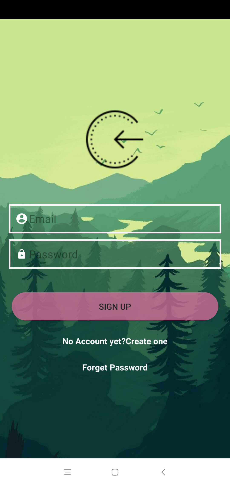
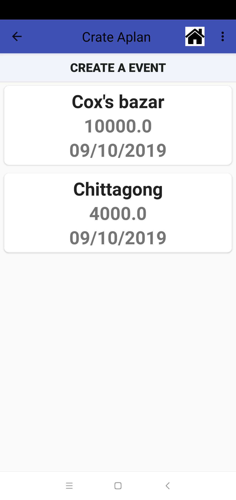
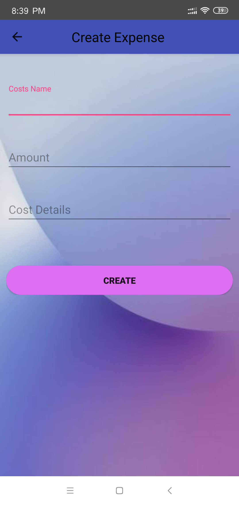
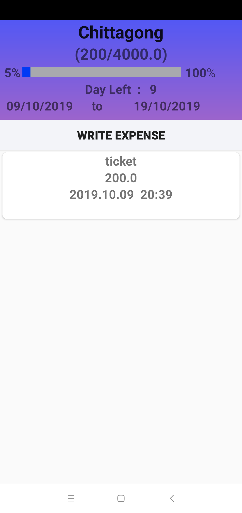
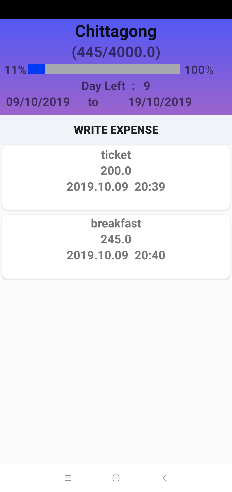

# Create a toure Plan
      Create a toure Plan where an user wishes to travel And write expense as a note against a                 
      perticular toure plan when a user make travel .    

#     Using  
      Swift , Xcode
      Core Data
      Create relationship Between Two table

                         

 
 
                         

                     
